# React Learning & Interview Guide

This folder is a hands-on React study notebook with runnable examples. The content progresses from rendering fundamentals through JSX, hooks, state management, effects, Context, reducers, performance optimization, and React 19 APIs.

Use this guide to study React concepts, practice implementations, and prepare for technical interviews.

---

## Quick Reference: Key Interview Topics

| Topic                       | Key Points                                                               | File                                       |
| --------------------------- | ------------------------------------------------------------------------ | ------------------------------------------ |
| **React Mental Model**      | Declarative UI, state → render, diff algorithm                           | [app.js](app.js)                           |
| **Events & Propagation**    | Bubbling, `preventDefault()`, `stopPropagation()`, event normalization   | [app1.js](app1.js)                         |
| **Components & Props**      | Uppercase naming, props read-only, JSX syntax, fragments                 | [app2.js](app2.js)                         |
| **useState**                | Setter schedules re-render, functional updaters, immutable updates       | [app2.js](app2.js)                         |
| **Keys in Lists**           | Must be stable/unique, prefer database id over index, can reset state    | [app3.js](app3.js)                         |
| **useEffect & Cleanup**     | Runs after render, dependencies, return cleanup function                 | [app5.js](app5.js)                         |
| **Async & Race Conditions** | Ignore flag pattern, AbortController, Suspense + use()                   | [app4.js](app4.js)                         |
| **useRef**                  | Doesn't cause re-render, DOM access, mutable value                       | [app6.js](app6.js)                         |
| **Custom Hooks**            | Extract stateful logic, name with "use", top-level only                  | [custom_hooks/](custom_hooks/)             |
| **Context**                 | Avoids prop drilling, provider + useContext, can cause re-renders        | [useContext_context/](useContext_context/) |
| **Reducers**                | Pure functions, current state + action → new state                       | [reducers.js](reducers.js)                 |
| **Memoization**             | `React.memo()`, `useMemo()`, `useCallback()` — use when measured as slow | [memo/](memo/)                             |
| **Equality**                | `===` (reference), `Object.is()`, shallow vs deep comparison             | [equality.js](equality.js)                 |
| **Closures & Stale Values** | Inner function captures outer scope, missing dependencies cause bugs     | [stale_closures.js](stale_closures.js)     |

---

## Visual Diagrams: React Core Concepts

### React Rendering Cycle

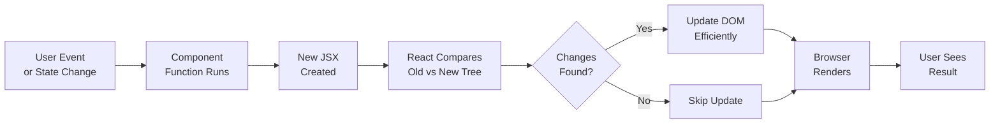

### Component Lifecycle with useEffect

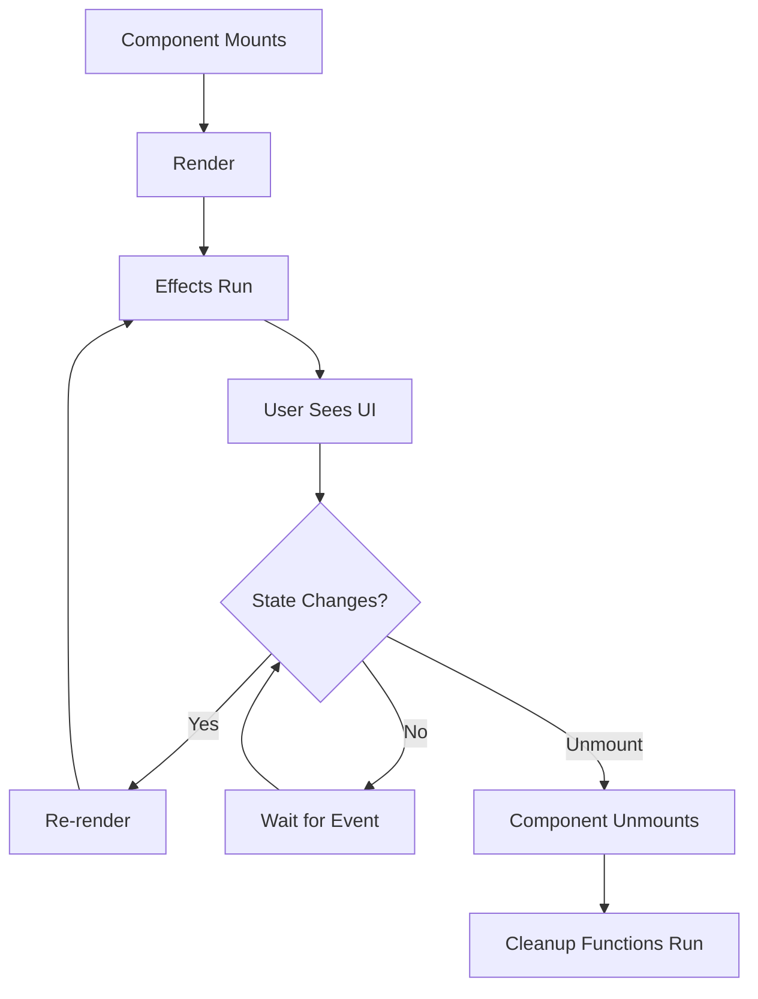

### useState: Synchronous vs Asynchronous

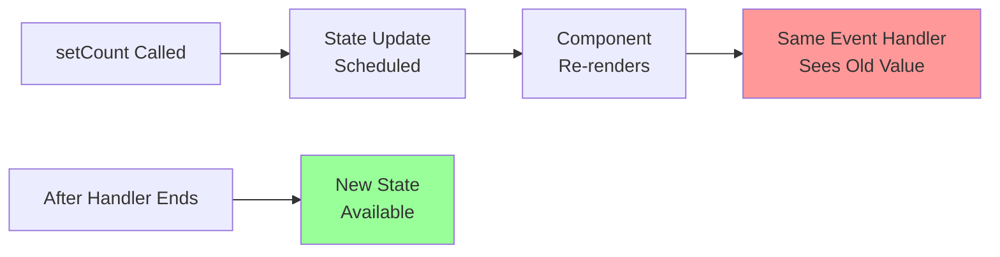

### Props Drilling vs Context

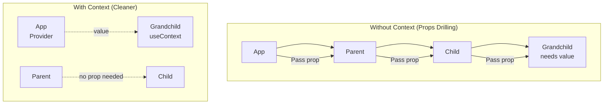

### useEffect Dependencies Flow

```mermaid
graph LR
    A["Component Renders"] --> B{"Dependencies<br/>Changed?"}
    B -->|No array| C["Effect Runs<br/>Every Render"]
    B -->|Empty []| D["Effect Runs<br/>Once on Mount"]
    B -->|"[dep1, dep2]"| E{"Values<br/>Changed?"}
    E -->|Yes| F["Effect Runs"]
    E -->|No| G["Effect Skipped"]
    F --> H["Cleanup Runs<br/>Before Next"]
    C --> H
    D --> I["Cleanup Runs<br/>on Unmount"]
```

### Async Effect Race Condition

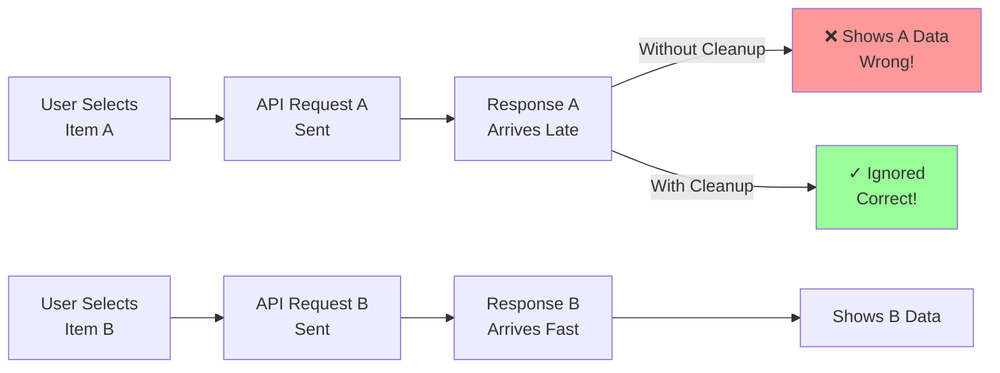

### Reducer Flow

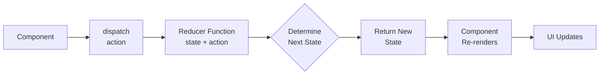

### React.memo Prevention of Re-renders

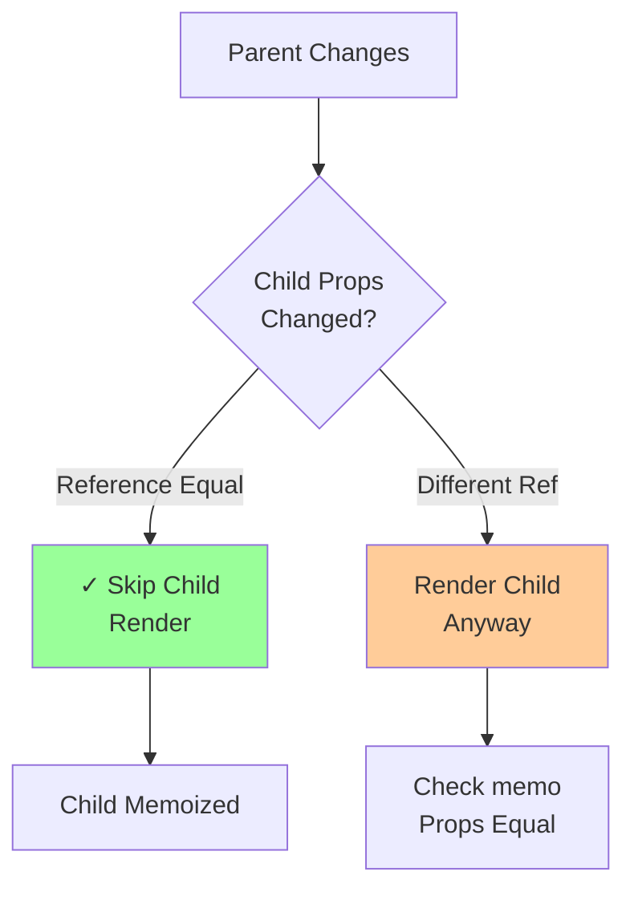

---

## How To Run The Examples

1. Open [index.html](index.html) with a local server, such as VS Code Live Server.
2. The active example is selected by the uncommented script tag near the bottom of `index.html`.
3. Keep only one example script active at a time.
4. Open the browser console for examples that demonstrate logging, rendering, equality, or memoization.
5. The React 19 experiments in `react_19_combined_useReducer_useContext/index.html`, `ref_as_props/index.html`, and `sandbox/index.html` can be opened separately.
6. The `vite_sandbox` folder is a separate project. Run `npm install` or `pnpm install` inside that folder, then use `npm run dev` or `pnpm dev`.

The current default entry point loads `es_modules/app.js`, which demonstrates a native JavaScript module import rather than a complete React UI.

### Exercise revisit note

The [exercise_revisit](exercise_revisit/) folder is a small React refresher that compares plain rendering with component-based structure and shows how React virtual elements map to real DOM updates.

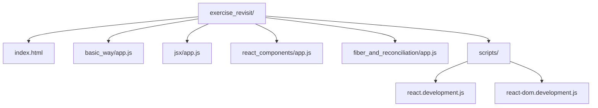

- [exercise_revisit/index.html](exercise_revisit/index.html) is the entry page and currently loads [exercise_revisit/fiber_and_reconciliation/app.js](exercise_revisit/fiber_and_reconciliation/app.js) via the `<script type="text/babel">` tag.
- [exercise_revisit/basic_way/app.js](exercise_revisit/basic_way/app.js) shows the most direct pattern: render a single `App` function with `React.createElement`, then inspect the DOM before and after React runs.
- [exercise_revisit/react_components/app.js](exercise_revisit/react_components/app.js) demonstrates a nested component pattern with an `App` wrapper and reusable `Counter` component.
- [exercise_revisit/jsx/app.js](exercise_revisit/jsx/app.js) rewrites the same idea using JSX syntax instead of raw `React.createElement`, making the structure easier to read.
- [exercise_revisit/fiber_and_reconciliation/app.js](exercise_revisit/fiber_and_reconciliation/app.js) introduces the reconciliation idea: a React tree with `CounterOne` and `CounterTwo`, and a conditional toggle between them using `counterName`.
- [exercise_revisit/scripts/react.development.js](exercise_revisit/scripts/react.development.js) and [exercise_revisit/scripts/react-dom.development.js](exercise_revisit/scripts/react-dom.development.js) are the local React runtime files used by this exercise.

This folder is useful for understanding how React elements, DOM nodes, and component composition relate to each other before moving into hooks and state management. It also makes the idea of reconciliation easier to see: React compares the old tree and the new tree, then updates only the parts that changed.

---

## Common Interview Questions & Answers

**Q: What's the difference between props and state?**

- Props: Read-only inputs from parent, cannot be modified by child
- State: Mutable data managed by the component itself

**Q: Why can't you mutate state directly?**

- React detects state changes by reference equality (`===`)
- Direct mutation doesn't create a new reference
- UI won't update; can cause stale/inconsistent rendering

**Q: When should you use `useCallback` or `useMemo`?**

- Only when you have a measured performance problem
- Check with React DevTools Profiler first
- Over-memoization can slow down your app

**Q: How do you handle async data fetching?**

- Use `useEffect` with cleanup to prevent stale requests
- Set an `ignore` flag or use `AbortController`
- Consider loading/error states and retries
- React 19: Use `use()` with `Suspense` and cached promises

**Q: What's the difference between `useContext` and Context?**

- Context: Created with `React.createContext()`
- useContext: Hook to read Context value
- Provider: Component that wraps tree and supplies value

**Q: How do you avoid prop drilling?**

- Use Context for values needed by many distant components
- Split contexts by concern (state, dispatch, theme, etc.)
- Keep provider values stable to prevent unnecessary re-renders

---

## Learning Roadmap

### 1. React's Core Mental Model

React is a **declarative UI library**:

- Describe what UI should look like for the current state
- Store changing data in state
- When state changes, React re-renders
- React compares new tree with old tree and updates only changed DOM nodes

**Imperative vs Declarative:**

```jsx
// ✗ IMPERATIVE - How to do it
const button = document.createElement("button");
button.textContent = "Click";
button.onclick = () => {
  count++;
  button.textContent = `Clicked ${count}`;
  document.body.style.color = count > 5 ? "red" : "black";
};

// ✓ DECLARATIVE - What it should be
function Counter() {
  const [count, setCount] = useState(0);
  return (
    <div style={{ color: count > 5 ? "red" : "black" }}>
      <button onClick={() => setCount(count + 1)}>Clicked {count}</button>
    </div>
  );
}
```

**Rendering Process:**

1. Component function runs → returns JSX
2. JSX converted to element tree (`React.createElement`)
3. React creates/updates DOM nodes
4. Repeat when state/props change

**React vs Vanilla JS:**

- Vanilla: Manually update DOM imperatively
- React: Declare desired UI, React handles updates

**createElement vs JSX:**

```jsx
// These are equivalent:
React.createElement("button", { className: "btn" }, "Click me")

<button className="btn">Click me</button>
```

Babel transforms JSX into `createElement` calls at build time.

Examples: [app.js](app.js), [app2.js](app2.js)

### 2. Events, Event Propagation, and Re-rendering

[app1.js](app1.js) demonstrates event handlers, propagation control, and re-rendering.

**✦ Event Propagation:**

| Method                             | Effect                                    | Use Case                        |
| ---------------------------------- | ----------------------------------------- | ------------------------------- |
| `event.preventDefault()`           | Stop browser default (submit, link, etc.) | Form handling, custom actions   |
| `event.stopPropagation()`          | Stop bubbling to parent                   | Nested clickable elements       |
| `event.stopImmediatePropagation()` | Stop this & parent handlers               | Multiple listeners              |
| Default (bubble)                   | Event travels up the tree                 | Catch events at container level |

**Why Bubbling Matters:**

```jsx
function handleParentClick() {
  console.log("parent");
}
function handleChildClick(e) {
  console.log("child");
  // Without e.stopPropagation() → logs "child" then "parent"
  e.stopPropagation(); // Prevents parent handler
}

return (
  <div onClick={handleParentClick}>
    <button onClick={handleChildClick}>Click</button>
  </div>
);
```

**Re-rendering Triggers:**

- ✓ State changes (`setState`)
- ✓ Props changes
- ✓ Context changes
- ✗ Local variable changes (just recompute, no render)
- ✗ External variable changes (need state)

**React Event Object:**

- Normalized across browsers
- Stored in event pool in older React versions (React 17+ auto-pooled)
- Access event in async code: store values first or use `e.persist()`

Example: [app1.js](app1.js)

### 3. Components, Props, and JSX

A component is a function that returns JSX. Component names must start with uppercase.

```jsx
function Counter({ name }) {
  return <h2>Counter {name}</h2>;
}

function App() {
  return <Counter name="First Counter" />;
}
```

**✦ Key Rules:**

| Rule              | ✓ Correct                 | ✗ Wrong                   |
| ----------------- | ------------------------- | ------------------------- |
| Props read-only   | `const name = props.name` | `props.name = "new"`      |
| Use className     | `<div className="box">`   | `<div class="box">`       |
| Event handlers    | `onClick={handleClick}`   | `onClick={handleClick()}` |
| JSX expressions   | `<h1>{count}</h1>`        | `<h1>{count}</h1>` broken |
| Fragment grouping | `<>...</>`                | Extra div in DOM          |

**Props vs Local Variables:**

- Props: Data from parent (re-render on change)
- Local variables: Recalculated every render, don't trigger re-render

```jsx
// ✗ Won't re-render when count changes
function Counter() {
  let count = 0;
  return <button onClick={() => count++}>{count}</button>;
}

// ✓ Will re-render
function Counter() {
  const [count, setCount] = useState(0);
  return <button onClick={() => setCount(count + 1)}>{count}</button>;
}
```

**Component Composition:**

- Use `children` prop to pass content
- Compose larger UIs from small, focused components

Example: [components_design/app.js](components_design/app.js)

### 4. State With `useState`

`useState` returns the current state and a setter function:

```jsx
const [count, setCount] = React.useState(0);
```

**✦ Key Behaviors:**

1. **Setter schedules re-render** - doesn't update synchronously
2. **State is a snapshot** - value is fixed during render/event handler
3. **Closures capture values** - event handlers see their render's state

**State Snapshot vs Functional Updater:**

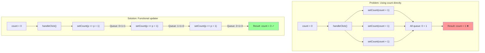

**Problem Example:**

```jsx
function handleClick() {
  setCount(count + 1);
  setCount(count + 1);
  setCount(count + 1);
  // All three use same render snapshot → count only increments by 1, not 3
}
```

**Solution: Functional Updater**

```jsx
function handleClick() {
  setCount((prev) => prev + 1);
  setCount((prev) => prev + 1);
  setCount((prev) => prev + 1);
  // Queued → count increments by 3
}
```

**Object State Immutability:**

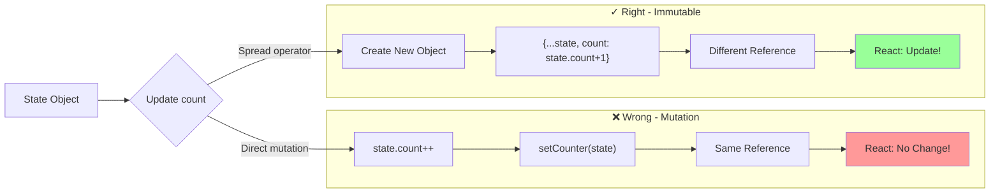

**Object State (Must be Immutable):**

```jsx
// ✓ DO THIS - Create new object
setCounter((prev) => ({
  ...prev,
  count: prev.count + 1,
}));

// ✗ DON'T DO THIS - Direct mutation
counter.count += 1;
setCounter(counter); // Same reference → React won't detect change
```

**Why Immutability?**

- React uses reference equality (`===`) to detect changes
- Mutation doesn't change the reference
- Can cause stale/inconsistent UI, skipped renders

Examples: [app2.js](app2.js), [app3.js](app3.js)

### 5. State Preservation, Position, and Keys

React associates state with a component's position in the rendered tree. [app3.js](app3.js) demonstrates mounting, unmounting, and swapping counters.

**✦ Interview Focus: Keys in Lists**

Keys tell React which item is which when rendering a list:

```jsx
{
  counters.map((counter) => <Counter key={counter.id} counter={counter} />);
}
```

**Key Rules:**

- ✓ Must be stable and unique among siblings
- ✓ Prefer database/domain id over array index
- ✓ Changing a key intentionally resets component state
- ✗ `key` is NOT passed to the component as a prop

**`useId` vs Keys:**

- `useId`: Creates stable identifiers for accessibility and form labels
- **NOT** a replacement for list keys
- **NOT** suitable as a data id

Examples: [useContext_context/app.js](useContext_context/app.js), [use_id_key/app.js](use_id_key/app.js)

### 6. Effects and Cleanup With `useEffect`

**Purpose:** Synchronize React component with an external system (DOM, API, browser APIs, etc.)

```jsx
React.useEffect(() => {
  // Setup code runs here
  document.title = `Clicks: ${count}`;

  return () => {
    // Cleanup runs before re-run or unmount
    document.title = "Original Title";
  };
}, [count]); // Dependencies
```

**✦ Dependency Array Patterns:**

| Array         | Runs         | When                                  |
| ------------- | ------------ | ------------------------------------- |
| `[count, id]` | After render | When count or id changes              |
| `[]`          | Once         | On mount only, cleanup on unmount     |
| No array      | Every render | After every render (⚠️ use carefully) |
| Omitted       | Every render | Same as no array                      |

**Common Cleanup Scenarios:**

```jsx
// Cancel subscriptions
useEffect(() => {
  const unsubscribe = subscribe();
  return () => unsubscribe(); // Cleanup
}, []);

// Abort fetch
useEffect(() => {
  const abort = new AbortController();
  fetch(url, { signal: abort.signal });
  return () => abort.abort(); // Cleanup
}, [url]);

// Clear timers
useEffect(() => {
  const timer = setTimeout(() => {}, 1000);
  return () => clearTimeout(timer); // Cleanup
}, []);
```

**⚠️ Common Mistakes:**

- Missing dependencies → stale values, infinite loops
- Not cleaning up → memory leaks, multiple listeners
- Doing calculations only in effects → should be in render

Examples: [app2.js](app2.js), [app3.js](app3.js), [app5.js](app5.js), [app6.js](app6.js), [custom_hooks/app.js](custom_hooks/app.js)

### 7. Async Effects and Race Conditions

**Problem:** When state changes trigger new API calls, older slower requests can overwrite newer results.

**Example:** User selects person A → fetches → person A data loads (fast), but then selects person B → fetches → person A response arrives last and overwrites person B data.

[app4.js](app4.js) demonstrates the solution.

**Solution: Ignore Flag Pattern**

```jsx
React.useEffect(() => {
  let ignore = false;

  loadData(id).then((data) => {
    if (!ignore) setData(data); // Only update if still relevant
  });

  return () => {
    ignore = true; // Cancel old requests when id changes
  };
}, [id]);
```

**Modern Alternatives:**

- `AbortController`: Cancel fetch requests directly
- Loading/error states: Show feedback to user
- Retries & caching: Handle failures gracefully
- Data fetching library: `React Query`, `SWR` (production apps)

**React 19 Approach:**

```jsx
// With Suspense + use()
<Suspense fallback={<Loading />}>
  <BioComponent person={person} />
</Suspense>;

// Inside component:
const bio = use(fetchBio(person)); // Cached promise
```

See: [app4.js](app4.js), [sandbox/index.html](sandbox/index.html)

### 8. `useRef`, DOM References, and React 19 Refs

A ref stores a mutable value that survives renders without causing a re-render when it changes.

```jsx
const inputRef = React.useRef(null);

React.useEffect(() => {
  inputRef.current?.focus();
}, []);
```

Use refs for:

- DOM focus, measurement, scrolling, and imperative APIs.
- A timer id or previous value that should persist without rendering.

Use state when the value belongs in the UI. Do not use refs as a hidden replacement for state.

[app6.js](app6.js) demonstrates `React.forwardRef` to pass a parent ref to a button. The React 19 [ref_as_props/index.html](ref_as_props/index.html) explores the newer ref-as-a-prop direction. That file is an experiment and currently contains an inconsistent variable reference (`buttonRef` inside `Counter`); treat it as a concept demo until corrected.

### 9. Custom Hooks

A custom hook extracts reusable stateful behavior. Its name starts with `use` and it may call other hooks.

Examples:

- `useCounter` owns counter state and exposes an increment operation
- `useDocumentTitle` synchronizes the browser title and restores it in cleanup

Both shown in [custom_hooks/app.js](custom_hooks/app.js).

**✦ Important:** Custom hooks share logic, not state. Every component calling `useCounter()` gets its own independent state.

**Rules of Hooks (ESLint enforces these):**

| Rule                       | ✓ Do                                | ✗ Don't                                |
| -------------------------- | ----------------------------------- | -------------------------------------- |
| **Top level only**         | Call at top of component            | In loops, conditions, nested functions |
| **React components/hooks** | Call from component/custom hook     | Call from regular JS functions         |
| **Consistent order**       | Same hooks, same order every render | Conditional hook calls                 |

Violating these causes: "Rendered fewer hooks than expected" or "Rendered more hooks" errors.

**Hooks Rules Visualization:**

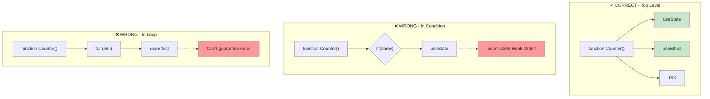

### 10. Props Drilling and Context

**Problem: Props Drilling** - Passing data through components that don't use it just to reach a deeper child.

See example before/after in [useContext_context/app.js](useContext_context/app.js).

**Solution: Context**

Context steps:

1. Create: `React.createContext(defaultValue)`
2. Provide: Wrap tree with `<ContextProvider value={{data}}>`
3. Consume: `const value = React.useContext(Context)`

**✦ Interview Focus: When to use Context**

✓ Good for:

- Theme, current user, locale, app-wide settings
- Reducing prop drilling for many distant components

✗ Not ideal for:

- Frequently changing values (causes re-renders)
- Always use as state manager (consider Redux/Zustand for complex state)

**Context Implementation Flow:**

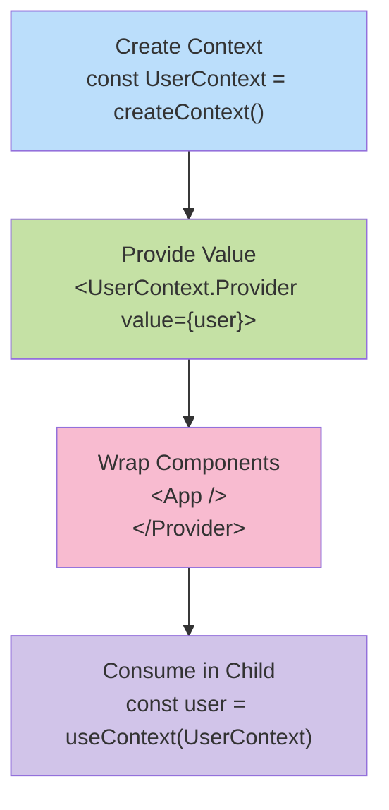

**Props Drilling vs Context Performance:**

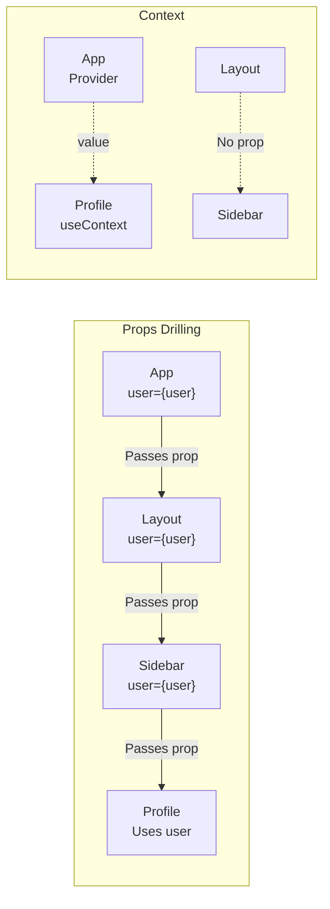

**Performance Optimization:**

- Separate state and dispatch contexts to reduce re-renders
- Keep provider value stable with `useMemo`
- Split contexts by concern (auth, theme, notifications)

Example: [usecontextAndusereducer/app.js](usecontextAndusereducer/app.js) uses split state/dispatch contexts with reducers

### 11. Reducers and Predictable State Transitions

A reducer calculates the next state from the current state and an action:

```jsx
function reducer(state, action) {
  switch (action.type) {
    case "increment":
      return state + 1;
    default:
      throw new Error("Unknown action");
  }
}

const [state, dispatch] = React.useReducer(reducer, 0);
dispatch({ type: "increment" });
```

**✦ Reducer Rules (must be PURE):**

| ✓ Do                                 | ✗ Don't                          |
| ------------------------------------ | -------------------------------- |
| Return new state object              | Mutate the existing state        |
| Calculate based on action            | Perform side effects (API calls) |
| Return same state if nothing changes | Depend on external data          |
| Describe events in actions           | Use actions as direct setters    |

Example action naming:

- ✓ `{ type: "USER_LOGGED_IN", payload: user }`
- ✓ `{ type: "ITEM_DELETED", id: 42 }`
- ✗ `{ type: "setName", value: "John" }` (sounds like a setter)

**When to use Reducer:**

- Complex state with multiple related values
- State depends on previous state
- Many components need to dispatch same actions
- Pair with Context for global state

Examples: [reducers.js](reducers.js), [app2.js](app2.js), [usecontextAndusereducer/app.js](usecontextAndusereducer/app.js)

### 12. Derived Data, `memo`, `useMemo`, and `useCallback`

**✦ Interview Focus: When to Optimize**

Derived data should normally be calculated from props and state during render. **Memoization is an optimization, not a correctness requirement.**

**Memoization Tools:**

| Tool            | Purpose                                           | When to Use                            |
| --------------- | ------------------------------------------------- | -------------------------------------- |
| `React.memo()`  | Skip child re-render if props unchanged (shallow) | Child has expensive render             |
| `useMemo()`     | Cache expensive calculation result                | Heavy computation (filtering, sorting) |
| `useCallback()` | Cache function identity across renders            | Passing function to memoized child     |

**Memoization Decision Tree:**

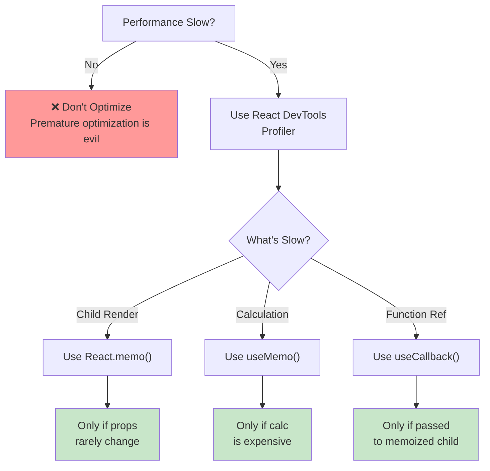

**When a memoized child still re-renders:**

- Its props changed by reference or value
- Its own state changed
- A consumed context value changed
- Parent passes a new callback/object each render

**Best Practice:** Use React DevTools Profiler to measure first. Premature memoization can slow things down.

Examples: [memo/app.js](memo/app.js), [usememo/app.js](usememo/app.js), [usecallback/app.js](usecallback/app.js)

Reference implementation: [memo/memoize.js](memo/memoize.js) shows general memoization outside React

### 13. Equality and Immutability

The supporting JavaScript examples explain why React state updates depend on references:

- `===` compares primitives by value and objects by reference.
- `Object.is` is similar but has special behavior for `NaN` and signed zero.
- Two separately created objects with the same fields are not reference-equal.
- A shallow comparison checks top-level properties only; nested objects still need the same reference.

Read [equality.js](equality.js) and [shallow_equality_is_object.js](shallow_equality_is_object.js).

This matters because React optimizations commonly use shallow/reference comparisons. Immutable updates make changed branches receive new references while unchanged branches can retain theirs.

### 14. Closures and Stale Values

[stale_closures.js](stale_closures.js) demonstrates a closure: an inner function keeps access to variables from its outer function even after the outer function has returned.

```js
function createCounter(incBy) {
  let value = 0;
  return [
    () => {
      value += incBy;
    },
    () => console.log(value),
  ];
}
```

The important React connection is that every render creates a new snapshot. An event handler or effect can close over the values from the render that created it. A missing effect dependency can therefore produce a stale value. The functional state updater and complete dependency arrays help avoid this class of bug.

### 15. React 19 APIs: `use`, Context, Suspense, and Refs

**✦ Interview Focus: `use()` vs `useEffect()`**

The `use()` API in React 19 provides new patterns:

| Feature  | use()                        | useEffect()               |
| -------- | ---------------------------- | ------------------------- |
| When     | Reads resource during render | Runs after render         |
| Purpose  | Read Context/promise         | Sync with external system |
| Suspense | Works with Suspense          | Doesn't pause render      |

**React 19 Examples:**

- **[use_context/](use_context/)** - `use(CounterContext)` instead of `useContext(CounterContext)`
- **[react_19_combined_useReducer_useContext/](react_19_combined_useReducer_useContext/)** - `use(Context)` + `useReducer`, split state/dispatch contexts, memoization strategies
- **[sandbox/](sandbox/)** - `use(fetchBio(person))` with cached promise + `<Suspense fallback={...}>` for pending state
- **[ref_as_props/](ref_as_props/)** - Ref-as-prop pattern (experimental feature in React 19)

**Key Distinction:**

- `use(Context)` reads during rendering → can re-render component
- `Suspense` pauses rendering while promise pending, shows fallback
- Promise caching prevents unnecessary re-fetches

### 16. JavaScript Modules and Data Structures

[es_modules/app.js](es_modules/app.js) and [es_modules/other_code.js](es_modules/other_code.js) demonstrate `import` and `export` with a native module script.

[linked_list_data_structure.js](linked_list_data_structure.js) and [queue_data_structure.js](queue_data_structure.js) cover linked-list nodes, head/tail references, append, traversal, and queue FIFO behavior. These are JavaScript fundamentals that support interview preparation and help explain why React state updates should preserve object identity intentionally.

#### Linked list note: node → next pointer chain

The example in [linked_list_data_structure.js](linked_list_data_structure.js) models a linked list as a sequence of nodes. Each node stores a value and a reference to the next node. The list keeps a `head` and `tail` pointer so appending to the end is efficient while traversal still happens by following `next` references.

```js
class LinkedListNode {
  constructor(val, next = null) {
    this.value = val;
    this.next = next;
  }
}

class LinkedList {
  constructor() {
    this.head = null;
    this.tail = null;
  }

  append(val) {
    const newNode = new LinkedListNode(val);

    if (!this.head) {
      this.head = newNode;
      this.tail = newNode;
      return this;
    }

    this.tail.next = newNode;
    this.tail = newNode;
    return this;
  }

  print() {
    let currentNode = this.head;
    while (currentNode) {
      console.log(currentNode.value);
      currentNode = currentNode.next;
    }
  }
}
```

This is the actual structure being created by the file:

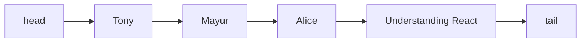

The important idea is that a linked list does not use index-based access like an array. Instead, each node points to the next one, so traversal starts at `head` and moves until `null` is reached.

### 17. Vite, Strict Mode, and Hot Module Replacement

[vite_sandbox](vite_sandbox) is a separate React 19 project created with Vite. Its important setup concepts are:

- [vite_sandbox/index.html](vite_sandbox/index.html) provides the HTML shell, the `root` mount element, the favicon, and the module entry point.
- [vite_sandbox/vite.config.js](vite_sandbox/vite.config.js) connects Vite with `@vitejs/plugin-react`, which transforms and refreshes React source files.
- [vite_sandbox/eslint.config.js](vite_sandbox/eslint.config.js) configures ESLint's recommended JavaScript rules, browser globals, React Hooks rules, and React Refresh rules while ignoring `dist`.
- [vite_sandbox/src/index.css](vite_sandbox/src/index.css) defines global layout, typography, color variables, responsive styles, and dark-mode styles. [vite_sandbox/src/App.css](vite_sandbox/src/App.css) defines the app-specific hero, counter, links, and responsive layout styles.
- [vite_sandbox/public](vite_sandbox/public) contains static files served from the site root, including the SVG icon sprite used by `<use href="/icons.svg#...">`.
- [vite_sandbox/src/assets](vite_sandbox/src/assets) contains imported image assets. Vite bundles imported assets and rewrites their URLs for the build.
- [vite_sandbox/README.md](vite_sandbox/README.md) records that the React Compiler is not enabled in this template and explains the available Vite plugin choices.
- [vite_sandbox/package.json](vite_sandbox/package.json) defines `dev`, `build`, `lint`, and `preview` scripts.
- Vite provides a development server, fast module replacement, and a production build. HMR updates the browser while developing without requiring a full manual reload.
- `StrictMode` is a development-only check that can intentionally re-run render/effect-related behavior to expose unsafe side effects. Code should remain correct when this happens.

The Vite template still contains starter content and is separate from the plain HTML examples. The root [index.html](index.html) loads local development React scripts and Babel, while Vite handles JSX and module transformation through its build toolchain.

---

## Interview Preparation Checklist

Before your interview, make sure you can explain:

### Fundamental Concepts

- [ ] Declarative vs Imperative programming
- [ ] React component lifecycle (mount, update, unmount)
- [ ] Difference between props and state
- [ ] How React detects changes (reference equality)
- [ ] Virtual DOM and reconciliation algorithm

### Hooks & State Management

- [ ] How `useState` works and setter behavior
- [ ] Why you need functional updaters
- [ ] `useEffect` dependencies and cleanup
- [ ] Custom hooks and composition
- [ ] `useContext` vs Context API
- [ ] `useReducer` vs `useState` trade-offs
- [ ] Rules of Hooks (ESLint rules)

### Performance & Optimization

- [ ] When to use `React.memo`, `useMemo`, `useCallback`
- [ ] How to measure performance (DevTools Profiler)
- [ ] Re-render causes and prevention
- [ ] Key best practices in lists

### Advanced Topics

- [ ] Handling async data fetching and race conditions
- [ ] Stale closures and capturing values
- [ ] Immutability patterns in React
- [ ] Component composition vs inheritance
- [ ] React 19 `use()` and Suspense patterns

### Can You Code?

- [ ] Build a component with useState and useEffect
- [ ] Create a custom hook
- [ ] Use Context without prop drilling
- [ ] Implement a reducer for complex state
- [ ] Handle form inputs and validation
- [ ] Prevent race conditions in effects

---

## Complete File Map

Use this map when revising a particular concept:

| File or folder                                                                                           | Main learning topic                                                         |
| -------------------------------------------------------------------------------------------------------- | --------------------------------------------------------------------------- |
| [index.html](index.html)                                                                                 | Browser setup, local React scripts, Babel, and selecting one example        |
| [app.js](app.js)                                                                                         | `React.createElement`, root rendering, props read-only idea                 |
| [app1.js](app1.js)                                                                                       | Event handlers, bubbling, `preventDefault`, `stopPropagation`, re-rendering |
| [app2.js](app2.js)                                                                                       | `useState`, `useReducer`, functional updates, object state, effects         |
| [app3.js](app3.js)                                                                                       | Conditional rendering, mounting, unmounting, effect cleanup                 |
| [app4.js](app4.js)                                                                                       | Async effects, loading state, stale request protection                      |
| [app5.js](app5.js)                                                                                       | Closures in intervals and timer cleanup                                     |
| [app6.js](app6.js)                                                                                       | `useRef`, focus, `forwardRef`                                               |
| [stale_closures.js](stale_closures.js)                                                                   | JavaScript closures and stale captured values                               |
| [reducers.js](reducers.js)                                                                               | Array `reduce` and reducer state transitions                                |
| [equality.js](equality.js)                                                                               | `==`, `===`, object reference equality, `Object.is`                         |
| [shallow_equality_is_object.js](shallow_equality_is_object.js)                                           | Shallow comparison and nested object references                             |
| [linked_list_data_structure.js](linked_list_data_structure.js)                                           | Linked list nodes, head, tail, append, traversal                            |
| [queue_data_structure.js](queue_data_structure.js)                                                       | Queue FIFO behavior built on linked nodes                                   |
| [components_design/app.js](components_design/app.js)                                                     | Composition, `children`, custom hooks, props                                |
| [custom_hooks/app.js](custom_hooks/app.js)                                                               | `useCounter`, `useDocumentTitle`, custom hook rules                         |
| [useContext_context/app.js](useContext_context/app.js)                                                   | Props drilling                                                              |
| [useContext_context/context.js](useContext_context/context.js)                                           | Context providers, consumers, nested provider values                        |
| [use_context/index.html](use_context/index.html)                                                         | React 19 `use(Context)`                                                     |
| [use_id_key/app.js](use_id_key/app.js)                                                                   | Stable keys, `useId`, Context, derived summary                              |
| [usecontextAndusereducer/app.js](usecontextAndusereducer/app.js)                                         | Split Context state/dispatch, reducers, tabs                                |
| [memo/app.js](memo/app.js)                                                                               | `React.memo`, Context, shallow prop comparison                              |
| [memo/memoize.js](memo/memoize.js)                                                                       | General-purpose memoization and closure-based cache                         |
| [usememo/app.js](usememo/app.js)                                                                         | `useMemo` for derived filtering                                             |
| [usecallback/app.js](usecallback/app.js)                                                                 | `useCallback` with memoized child components                                |
| [react_19_combined_useReducer_useContext/index.html](react_19_combined_useReducer_useContext/index.html) | React 19 `use`, reducers, Context, memoization                              |
| [sandbox/index.html](sandbox/index.html)                                                                 | `use` with cached promises and `Suspense`                                   |
| [ref_as_props/index.html](ref_as_props/index.html)                                                       | React 19 ref-as-prop experiment                                             |
| [es_modules/app.js](es_modules/app.js)                                                                   | Native `import`                                                             |
| [es_modules/other_code.js](es_modules/other_code.js)                                                     | Named `export` and a model class                                            |
| [vite_sandbox/src/App.jsx](vite_sandbox/src/App.jsx)                                                     | Vite starter app, `useState`, functional updater, assets                    |
| [vite_sandbox/src/main.jsx](vite_sandbox/src/main.jsx)                                                   | `createRoot`, imports, `StrictMode`                                         |
| [vite_sandbox/index.html](vite_sandbox/index.html)                                                       | Vite HTML entry point and root mount element                                |
| [vite_sandbox/vite.config.js](vite_sandbox/vite.config.js)                                               | Vite React plugin configuration                                             |
| [vite_sandbox/eslint.config.js](vite_sandbox/eslint.config.js)                                           | ESLint and React Hooks/Refresh rules                                        |
| [vite_sandbox/src/index.css](vite_sandbox/src/index.css)                                                 | Global and responsive CSS                                                   |
| [vite_sandbox/src/App.css](vite_sandbox/src/App.css)                                                     | App-specific CSS and layout                                                 |
| [vite_sandbox/public](vite_sandbox/public)                                                               | Static favicon and SVG icon sprite                                          |
| [vite_sandbox/src/assets](vite_sandbox/src/assets)                                                       | Bundled React, Vite, and image assets                                       |
| [vite_sandbox/README.md](vite_sandbox/README.md)                                                         | Vite template and React Compiler notes                                      |
| [vite_sandbox/package.json](vite_sandbox/package.json)                                                   | Vite scripts and React dependencies                                         |

## Interview Revision Questions

### Beginner

1. What problem does React solve compared with manually changing the DOM?
2. What is the difference between a component, a prop, and state?
3. Why are props read-only?
4. What does `createRoot(...).render(...)` do?
5. What is JSX compiled into?
6. Why does a state setter cause a component to render again?
7. Why should a list use a stable key?
8. What is the difference between `onClick={handleClick}` and `onClick={handleClick()}`?

### Intermediate

1. Why can three `setCount(count + 1)` calls produce only one increment?
2. When should a functional state updater be used?
3. Why is mutating an object in state unsafe?
4. Explain the three dependency-array forms of `useEffect`.
5. Why does an effect need cleanup for timers and subscriptions?
6. How can an old network response overwrite newer UI, and how can cleanup prevent it?
7. What is the difference between state and a ref?
8. What does Context solve, and what problem does it not solve?
9. What makes a reducer pure?
10. Why is an index a risky key when list items can be inserted, deleted, or reordered?

### Advanced

1. How does React preserve or reset state based on tree position and keys?
2. Why can a Context provider cause many consumers to re-render?
3. When can `React.memo` fail to prevent a child render?
4. What is the difference between memoizing a value and memoizing a function?
5. Why must memoization dependencies include every reactive value used by the calculation?
6. When is derived data better calculated during render than stored in state?
7. How do immutable updates support shallow equality and structural sharing?
8. What does `use()` do in the React 19 Suspense example?
9. Why does promise caching matter when using `use()` during render?
10. When should a ref be used instead of state for an imperative value?

## Common Corrections To Remember

The examples are learning exercises, so keep these differences in mind when answering interviews or writing production code:

- Copying an array does not deep-copy its objects. Update the changed object with `{ ...object }` too.
- A decrement guard should prevent values below zero. Check the condition carefully when writing the reducer.
- In the current `counterReducer` examples, `counter.total >= 0 ? counter.total - 1 : 0` still returns `-1` when the total is zero. A correct guard is `counter.total > 0 ? counter.total - 1 : 0`.
- Include all reactive dependencies in `useEffect`, `useMemo`, and `useCallback` dependency arrays.
- Use buttons for actions instead of anchor elements with `href="#"`; this avoids unnecessary default navigation and `preventDefault` calls.
- `key` is not available through `props.key`.
- `useId` is for generated DOM ids, not list identity.
- Effects are for external synchronization, not ordinary calculations.
- `React.memo`, `useMemo`, and `useCallback` should be added after identifying a real rendering or calculation cost.
- In [shallow_equality_is_object.js](shallow_equality_is_object.js), `person1` and `person2` have separate nested `cours` objects, so a shallow comparison returns `false`; the nearby comment saying `true` is incorrect.
- In [stale_closures.js](stale_closures.js), calculating `message` outside `log()` would capture an old value. Calculating it inside `log()` reads the current closed-over value.
- The React 19 ref-as-prop example needs its ref variable naming fixed before it can run correctly.

## Suggested Next Topics

The current folder gives a strong hooks and state foundation. The next interview-focused topics to add are:

- Controlled versus uncontrolled forms and validation.
- Error boundaries and loading/error/empty UI states.
- Routing and nested layouts.
- Testing components with React Testing Library.
- Accessibility and keyboard interaction.
- Network caching and server state with a data-fetching library.
- Strict Mode, concurrent rendering, transitions, and `useDeferredValue`.
- React Server Components and framework routing when using a framework such as Next.js.
- TypeScript props, state, reducers, and custom hooks.

## Quick Glossary

- **Render:** React calls components to calculate the next UI description.
- **Commit:** React applies the required changes to the DOM.
- **Props:** Read-only data passed from parent to child.
- **State:** Component-owned data that can trigger rendering.
- **Effect:** Synchronization with something outside React.
- **Reducer:** Pure function from `(state, action)` to next state.
- **Context:** A way to read a value from a provider without passing it through every component.
- **Key:** Stable identity for an item in a rendered list.
- **Ref:** Persistent mutable container, often used for DOM nodes.
- **Memoization:** Reusing a previous result when its inputs have not changed.
