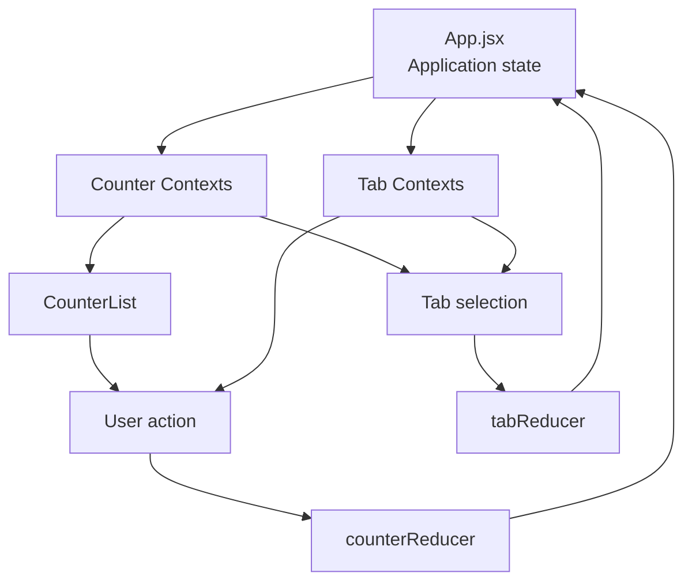

# Counter Dashboard

A small React 19 counter dashboard built with Vite. The application demonstrates how to manage shared state with `useReducer` and React Context while keeping the UI split into focused components.

The dashboard displays three counters. Each counter can be incremented, the summary can be filtered by tab, and the summary is sorted by the current total. The browser document title also reflects the current counter totals.

## Features

- Increment counters from the counter list.
- Decrement counters while their value is greater than zero in the UI.
- Switch between Tab 1 and Tab 2 in the summary tools.
- Sort visible counters by descending total.
- Update the document title with the current totals and restore the previous title when the hook is cleaned up.
- Log elapsed seconds for Counter A while it is visible on the active tab.

## Architecture

The application uses a unidirectional data flow:



### State ownership

`src/App.jsx` is the state owner. It creates two reducer states:

- `counterData`: an array of `CounterObj` values managed by `counterReducer`.
- `visibleTab`: the active tab number managed by `tabReducer`.

Both state values and their dispatch functions are provided through separate contexts in `src/context/contexts.js`. Separating read contexts from dispatch contexts lets components consume only the part of the state they need.

### Component responsibilities

- `CounterList` reads the counter collection, updates the document title through `useDocumentTitle`, and renders one `Counter` per item.
- `Counter` displays a counter and dispatches `increment` or `decrement` actions. It also owns the visibility-dependent timer effect for Counter A.
- `CounterTools` is the summary tools boundary.
- `CounterSummary` reads counters and the active tab, sorts and filters the data, and dispatches tab changes.
- `CounterSummaryHeader` renders the tab controls and is memoized with `memo`.
- `CounterSummaryDetails` renders one sorted summary row and is memoized with `memo`.

### Reducers and model

- `src/reducers/counter_reducer.js` returns a new counter array for every increment or decrement action. The matching counter object is copied with an updated `total`.
- `src/reducers/tab_reducer.js` changes the active tab in response to a `change-tab` action.
- `src/models/counter_obj.js` defines the shape used to initialize each counter: `id`, `name`, `tab`, and `total`.

This keeps state transitions predictable: components dispatch events, reducers calculate the next state, and React re-renders consumers of the relevant context.

## Project structure

```text
src/
|-- App.jsx                         # Application state and context providers
|-- components/
|   |-- Counter.jsx                 # Individual counter controls
|   |-- Counter_List.jsx            # Counter collection and document title
|   |-- Counter_Tools.jsx           # Summary tools boundary
|   |-- Counter_Summary.jsx         # Sorting, filtering, and tab actions
|   |-- Counter_Header_Summary.jsx  # Tab controls
|   `-- Counter_Summary_Details.jsx # Summary row
|-- context/contexts.js             # State and dispatch contexts
|-- hooks/use_document_title.js     # Document title effect with cleanup
|-- models/counter_obj.js           # Counter data model
`-- reducers/
	|-- counter_reducer.js           # Counter state transitions
	`-- tab_reducer.js               # Active tab state transitions
```

## Getting started

Install dependencies:

```bash
pnpm install
```

Start the development server:

```bash
pnpm dev
```

Run the checks and production build:

```bash
pnpm lint
pnpm build
```

To preview the production build locally:

```bash
pnpm preview
```

## Technology stack

- React 19
- React DOM 19
- Vite
- ESLint
